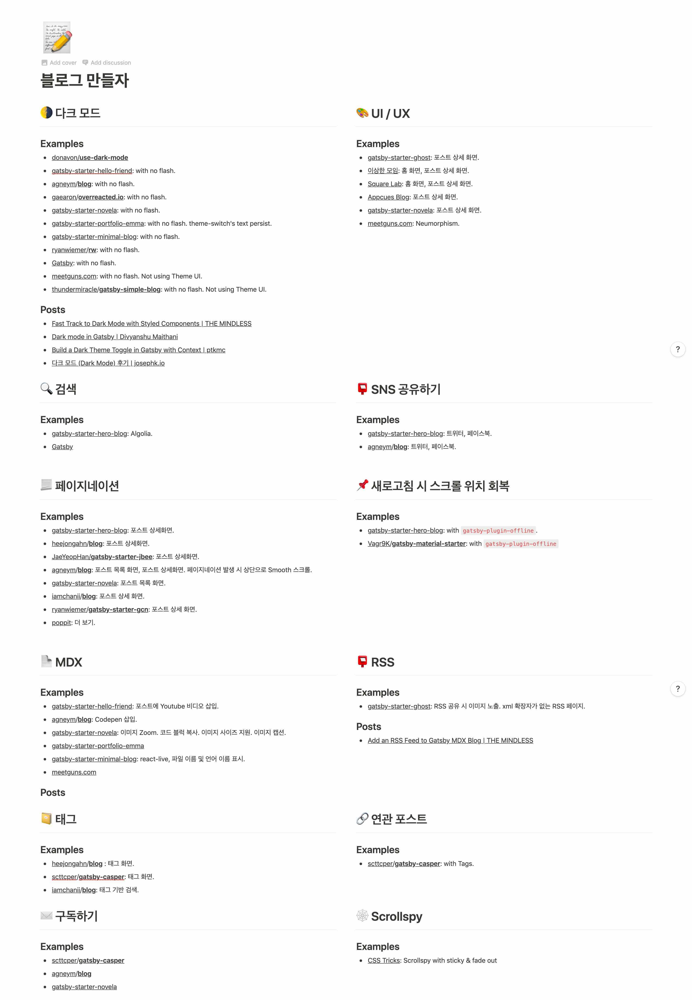
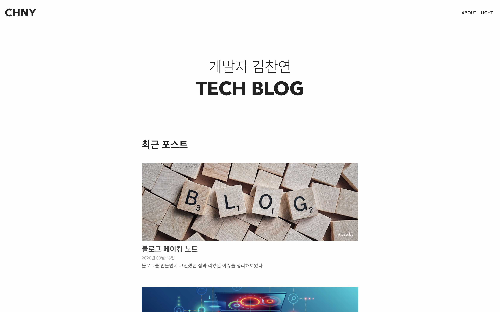

## 블로그 시작 {#blog-start}

2017년 말에 잠깐 끄적이다가 관뒀던 블로그 포스팅을 올해부터 다시 시작해보기로 했다.

먼저 글을 올릴 공간이 필요했다. 기존에는 Jekyll 기반의 무료 템플릿을 사용해서 만든 블로그에 글을 올렸었는데 이번에는 다른 사람이 만든 템플릿을 가져다쓰지 않고 내가 원하는 스타일의 블로그를 직접 만들어보고 싶었다. 따라서 커스터마이징이 비교적 덜 자유로운 미디엄이나 티스토리 등의 서비스형 블로그는 고려대상에서 제외했고, 평소에 React 개발에 가장 익숙했던 만큼, 내부적으로 React를 사용하는 [Gatsby](https://www.gatsbyjs.org/)를 이용해 블로그를 만들어보기로 했다.

먼저, 조사를 통해 블로그에 넣고 싶은 기능과 기술 및 예상되는 이슈를 쭉 적어본 다음 각 항목에 대해 참고할 자료를 [개인 노트](https://www.notion.so/chayeoi/d7229a9edcb04966bd7fe8f03bc7e03f)에 정리했다.



이렇게 조사한 자료를 바탕으로 가볍게 스케치를 그려보았고 퇴근 후 평일 저녁 시간과 주말을 활용해 틈틈이 개발한 결과, 어느 정도 봐줄만한(?) 형태의 블로그가 만들어졌다.



## 블로그를 만드는 과정에서 고민했던 점들 {#things-i-worried-about-while-making-blog}

글을 읽는 사람으로 하여금 콘텐츠에 더 집중할 수 있게 하고 사용성을 높일 방법을 고민했다. 구체적으로 어떤 부분을 고민했는지, 그리고 각 부분과 관련해 어떤 이슈가 있었는지 하나씩 차례대로 정리해보았다.

### 블로그 진입 화면의 콘텐츠 구성 {#contents-of-blog-entry}

내 블로그에 방문하는 사람의 목적은 당연히 글을 읽고 정보를 얻기 위함일테므로, 진입 화면에 불필요한 정보를 최대한 넣지 않고 최신 글 목록을 바로 노출하도록 하여 새 글에 대한 관심을 유도했다. 거의 모든 블로그의 진입 화면이 이런 형태의 구성을 취하고 있다.

### 다크모드 지원 {#dark-mode-support}

다크모드를 사용할 경우 디바이스의 전력 소모를 줄일 수 있고 방문자는 글을 읽는 동안 눈의 피로를 줄일 수 있다고 한다. 이런 특징 덕분에 최근 몇 년 사이에 많은 서비스들이 다크모드를 지원하기 시작했고, 이러한 트렌드에 맞춰 내 블로그에도 다크모드를 적용해보았다.

다크모드를 구현하는 과정에서 몇 가지 이슈가 있었다.

#### 이슈 1. 컬러모드 변경 시 [Utterances](https://utteranc.es/)의 theme이 함께 변경되어야 한다. {#utterances-issue}

코멘트 기능 지원을 위해 [Utterances](https://utteranc.es/)를 사용하고 있다. Utterances 스크립트 호출 시 원하는 theme을 속성 값으로 전달하면 그에 맞는 `theme`으로 코멘트 창을 `iframe` 형태로 화면에 보여주게 되는데, 블로그의 컬러모드 변경 시 Utterances의 theme만 밝은 색상으로 유지되는 게 어색해보였기 때문에 Utterances의 theme도 함꼐 변경할 방법이 필요헀다.

다행히도 `iframe?.contentWindow.postMessage()`를 이용해 Utterances의 theme을 동적으로 변경할 수 있는 방법이 존재했고, 블로그의 컬러모드를 변경할 때마다 이 함수를 호출하도록 하여 문제를 해결했다.

```tsx
useEffect(() => {
  const message = {
    type: 'set-theme',
    theme: theme.palette.type === ColorMode.LIGHT ? UtterancesTheme.GITHUB_LIGHT : UtterancesTheme.DARK_BLUE,
  }

  const iframe = document.querySelector<HTMLIFrameElement>('.utterances-frame')

  const value = localStorage.getItem(COLOR_MODE_KEY) as ColorMode

  if (iframe && value) {
    iframe.contentWindow?.postMessage(message, 'https://utteranc.es')
  }
}, [theme.palette.type])
```

#### 이슈 2. 화면 새로고침 시에도 새로고침 이전의 컬러모드 상태가 유지되어야 한다. {#refreshing-issue}

컬러모드 상태 값을 React의 내부 state로 관리하고 있기 때문에 화면을 새로고침할 경우 컬러모드가 기본값으로 초기화되는 문제가 발생했다. 이 문제는 컬러모드 변경 시 그 값을 로컬스토리지에 저장하도록 함으로써 간단히 해결되었다.

#### 이슈 3. 브라우저의 상태바 색상도 함께 변경되어야 한다. {#pwa-status-bar-issue}

안드로이드 기반의 Chrome 또는 Samsung Internet 브라우저의 상태바 색상은 `meta[name="theme-color"]` 요소를 사용하여 지정할 수 있다. 블로그의 컬러모드 변경 시 변경된 값에 따라 이 meta 태그의 값을 함께 변경하도록 해서 문제를 해결했다.

#### 미해결 이슈 {#unresolved-issues}

다크모드와 관련해서 여전히 개선해야 할 부분들이 몇 가지 남아있다.

1. `prefers-color-scheme` 미디어쿼리 적용: 사용자가 사용 중인 시스템 테마에 기반해 컬러모드의 초기값을 설정하도록 한다.
2. 다크모드 적용 시 화면 깜빡임(FOUC) 현상 개선: 다크모드에서 화면 새로고침 시 일시적으로 라이트모드가 적용되는 현상을 해결한다.

조만간 위 문제들을 모두 해결하고나서 다크모드를 구현했던 자세한 과정에 대해 따로 정리할 생각이다.

### 스크롤스파이(Scrollspy)로 콘텐츠 목차 보여주기 {#scrollspy}

사용자가 글을 읽어내려감에 따라 현재 보고 있는 섹션이 어디인지 나타내줄 수 있도록 화면 우측 상단에 스크롤스파이(Scrollspy)를 추가했다. 모바일과 태블릿 화면에서는 콘텐츠만 보여주기에도 공간이 여의치 않기 떄문에, 스크롤스파이는 데스크톱 화면에서만 보여주도록 했다.

구글에 찾아보니 스크롤스파이를 쉽게 구현하도록 도와주는 라이브러리가 여럿 존재했다. 그러나 API 설계 방식이 확 끌리는게 없어서 직접 구현하는 방법을 택했다.

`scroll` 이벤트에 대한 이벤트 리스너를 등록하여 스크롤스파이를 구현할 수도 있지만, 그보다는 `IntersectionObserver` API를 사용하는 게 성능적으로 더 좋기 떄문에 후자의 방식을 사용하여 Scrollspy를 구현했다. Scrollspy 구현에 관한 부분은 다음 커밋에서 차례대로 확인할 수 있다.

1. [`1658822`](https://github.com/chayeoi/blog/commit/16588220c98d43dbf403a7dcf5aadcd2320efef5)
2. [`a16bfc9`](https://github.com/chayeoi/blog/commit/a16bfc9a270bb0c675773fe9c7750801e50e104a)
3. [`8e8c21c`](https://github.com/chayeoi/blog/commit/8e8c21cca4fce19dade3c0d0f3a0850df639d759)
4. [`f77d6a3`](https://github.com/chayeoi/blog/commit/f77d6a34b6c2f73bf29f522c784e220f82ddfa2f)

### SNS 공유하기 {#sns-share}

포스트를 SNS로 쉽게 공유할 수 있도록 'SNS 공유하기' 버튼을 추가했다. 개발자들이 많이 사용하는 플랫폼인 페이스북, 트위터와 함께 한국이라는 지역적 특성을 고려해서 카카오톡 공유하기를 추가했다.

### MDX 지원 {#mdx}

[MDX](https://mdxjs.com/)는 마크다운 문서에서 JSX를 사용할 수 있도록 한 파일 포맷인데, MDX 파일에서 JSX 파일을 직접 import 수 있는 등 일반 마크다운 문서보다 더 많은 기능을 제공할 수 있어서 적용해보았다. 아직 적극적으로 사용 중이진 않은 기능이다. 우선 어떤 식으로 활용할 수 있을 지 공부가 더 필요할 것 같다.

### PWA 지원 {#pwa}

사실은 블로그를 PWA로 개발하는 게 무슨 의미가 있을까 고민도 했는데, Gatsby에서는 `gatsby-plugin-manifest`와 `gatsby-plugin-offline` 이 두 플러그인을 추가하는 것만으로도 웬만한 PWA 기능을 쉽게 지원할 수 있기 때문에 적용해보았다. 별도로 내가 설정한 부분은 iOS용 스플래시 이미지를 추가한 정도 밖에 없다.

### 접근성 {#a11y}

접근성은 어떤 서비스를 만들더라도 기본적으로 고려해야하는 부분이기에, 접근성을 높이려고 열심히 노력했다.

1. 본문 바로가기 링크 추가 ([`0b9aaae`](https://github.com/chayeoi/blog/commit/0b9aaae6ed350edffb0bcc48df7de604ce17ce7a)): 키보드를 통해 콘텐츠를 탐색하는 방문자를 위해 본문 바로가기 링크를 추가했다.
2. 용도에 적합한 semantic 태그 사용: 링크 요소와 form 관련 요소가 적절한 상황에서 `focus` 이벤트를 받을 수 있도록 용도에 적합한 semantic 태그를 사용했다.
3. `focus` 이벤트에 대한 CSS 스타일 적용: focus된 요소를 쉽게 식별할 수 있도록 링크와 폼 요소에 `focus` 스타일을 적용했다.

Lighthouse로 접근성 점수를 측정해본 결과 98점이 나왔는데, 2점이 감점된 요인은 글 목록 화면에서 글자 색과 배경 색의 대비가 낮은 부분이 있기 때문인 것으로 보인다. 추후 개선해야할 사항으로 추가해놓았다.

## 남은 작업들 {#things-to-complement}

앞으로 남은 작업들을 [저장소 이슈 목록](https://github.com/chayeoi/blog/issues)에 정리해놓았다. 급한 작업은 없기 떄문에 여유가 있을 때 천천히 진행할 생각이다.
